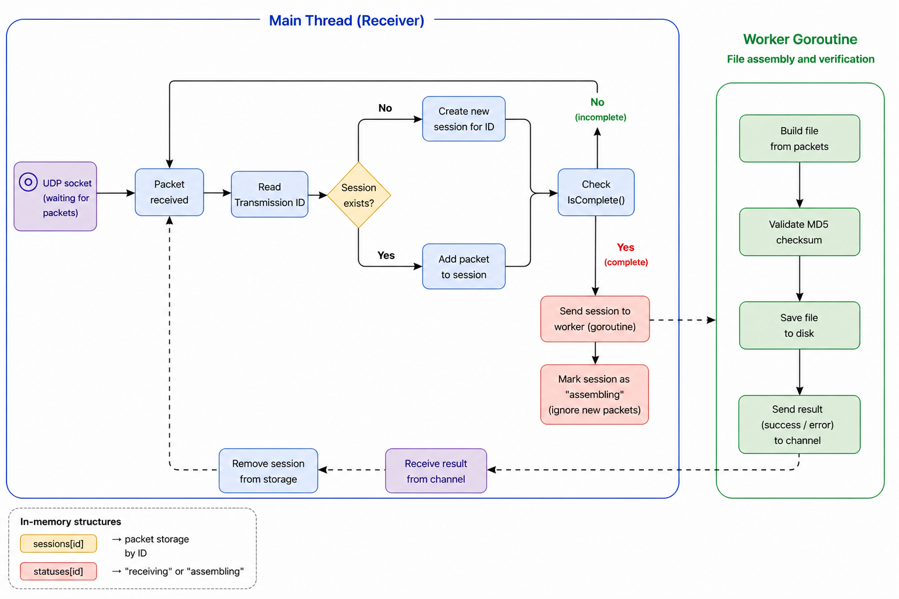

# Simple UDP File Transfer

A simple UDP-based file transfer application with support for parallel file assembly using goroutines.

---

## Start the Receiver

```bash
go run . receiver
```

Starts a UDP server listening on port 9000
Receives incoming file packets
Reassembles files in parallel and saves them locally

The receiver expects a folder named testdata in the project root.
All received files will be saved there with the prefix:

rec_<original_filename>

## Receiver Flow

The receiver processes incoming UDP packets and distributes them into sessions based on their transmission ID.
Each session collects packets until the file is complete.

Once a session is complete, it is passed to a separate worker (goroutine),
which rebuilds the file, validates its integrity (MD5), and saves it to disk.

Meanwhile, the receiver continues processing incoming packets without blocking.

<p align="center">  </p>

## Send a File

```bash
go run . sender file-path
```

Example:
```bash
go run . sender testdata/example.txt
```

